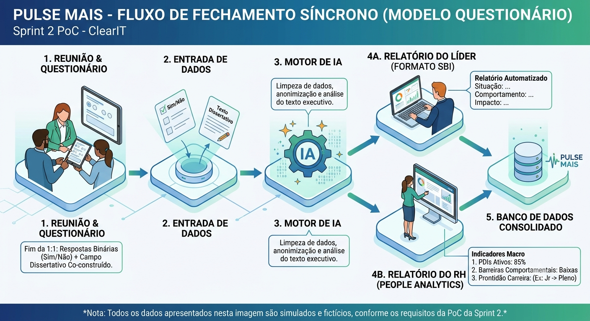

# 📊 Projeto Pulse Mais — Plataforma de Fechamento de Feedbacks (ClearIT)

Este repositório contém os artefatos de Engenharia, Regras de Negócio e a Prova de Conceito (PoC) da plataforma **Pulse Mais**, desenvolvida sob medida para a **ClearIT**. 

Nesta Sprint 2, realizamos um **Pivot de Escopo Estratégico** em cooperação com as orientações acadêmicas e a liderança de Recursos Humanos da empresa parceira. Eliminamos completamente qualquer barreira de gravação de áudio, substituindo-a por um modelo de **Mapeamento Quanti-Qualitativo Síncrono** de altíssima adesão e total segurança jurídica.

---

## 🗺️ Fluxo de Funcionamento da Solução (PoC/MVP)

O infográfico abaixo ilustra a arquitetura da solução: o processo se inicia no encerramento da agenda de feedback, passa pela ingestão de dados estruturados (binários e dissertativos), sofre o processamento da IA e se ramifica nas visões do Líder e do RH.

---

## ⚙️ Diretrizes do Pivot de Arquitetura (Por que mudamos?)

1. **Garantia de Conversas Verdadeiras (Segurança Psicológica):** A gravação contínua de áudio inibiria colaboradores e líderes. O modelo de formulário preserva a espontaneidade da reunião.
2. **Eliminação de Passivos Jurídicos (LGPD):** Ao não armazenar biometria de voz, mitigamos riscos de segurança da informação e custos com infraestrutura de armazenamento de áudio.
3. **Filtro Rígido Antifofoca (Limpeza por IA):** O RH necessita de dados analíticos macros. A Inteligência Artificial atua como um *guardrail*, limpando desabafos íntimos e focando exclusivamente em indicadores organizacionais.

---

## 📌 Links Rápidos da Estrutura do Repositório

### 📂 Pasta `docs/` (Planejamento e Negócio)
* 📄 [Contexto Técnico Lite - Etapa 2](docs/technical-context-lite.md) — Documentação da viabilidade técnica, testes de engenharia de prompts e outputs gerados a partir do processamento textual.

### 📂 Pasta `src/` (Arquitetura do MVP)
* 🛠️ [Templates de Prompts (JSON)](src/prompts_templates.json) — Arquivo de configuração de infraestrutura onde residem as instruções enviadas ao Large Language Model (LLM).
* 📊 [Exemplo de Entrada de Formulário (JSON)](src/mock_form_input.json) — Modelo exato dos dados coletados pelo aplicativo no momento em que o questionário e a dissertação são salvos.
* 📱 [Fluxo de Interface e Telas (UI/UX)](src/interface_flow.md) — Mapeamento detalhado das jornadas visuais do Líder (Formulário rápido) e do RH (Dashboard analítico).

---

## 🛡️ Matriz de Processamento Quanti-Qualitativo (A Lógica da IA)

A solução consome duas frentes de dados coletadas em menos de 5 minutos ao fim de cada 1:1:

| Tipo de Input | Origem do Dado | Objetivo Técnico da IA |
| :--- | :--- | :--- |
| **Dados Estruturados** | Perguntas Binárias (Sim/Não) | Alimentar gráficos estatísticos do RH e calcular taxas de risco e aderência à cultura. |
| **Dados Não Estruturados** | Campo Dissertativo-Argumentativo | Mapear o contexto macro da reunião e estruturar os relatórios utilizando frameworks de liderança. |

### Exemplo Prático de Saída Triada pela Solução:
*   **Visão do Líder (Modelo SBI):** Transforma o texto corrido digitado na ferramenta em um plano estruturado de *Situação, Comportamento e Impacto*, sugerindo desdobramentos flexíveis para o PDI.
*   **Visão do RH (People Analytics):** Consolida apenas os indicadores críticos extraídos da argumentação: 1) Existência de PDI ativo; 2) Bloqueios comportamentais recorrentes; 3) Prontidão de Carreira (elegibilidade para transições de níveis como Júnior, Pleno e Sênior).

---

## 👥 Integrantes do Projeto e Divisão de Frentes
*   **João Pedro** — *Product Manager / Product Designer*: Responsável pelo escopo, especificação de requisitos, mapeamento de dores e alinhamento de regras de negócio.
*   **Pedro** — *Lead Backend Engineer*: Responsável pela definição da modelagem de dados, arquitetura de entidades e estruturação do contrato REST API.
*   **Gustavo** — *Machine Learning / Prompt Engineer*: Responsável pelo desenvolvimento e validação dos templates de prompts e infraestrutura de guardrails de privacidade (LGPD).
*   **Nathalia** — *Frontend Engineer*: Responsável pelo desenho e validação da interface, mockups de fluxo de telas (UI/UX) e acessibilidade para líderes e RH.
*   **Mikael** — *QA & Compliance Engineer*: Responsável pela validação funcional, controle de qualidade, testes da PoC com massa de dados simulada e conformidade regulatória.

---

## 🎯 Status da Sprint 2
A viabilidade técnica de extrair indicadores profundos e padronizar relatórios SBI sem a necessidade de processamento de áudio foi **100% validada**. A solução se provou leve, escalável e perfeitamente alinhada com as necessidades estratégicas de retenção de talentos e privacidade corporativa da ClearIT.

---
*Nota: Todos os dados apresentados, templates de prompts e arquivos de massa de dados anexados neste repositório utilizam informações puramente simuladas e fictícias para fins de Prova de Conceito (PoC).*
