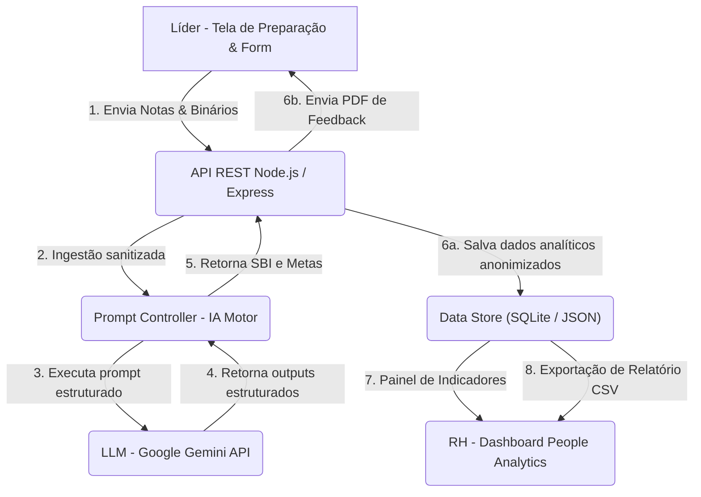

# Contexto Técnico (SSOT de Engenharia) — Pulse Mais & ClearIT

## 1. Stack Tecnológica Detalhada

Para garantir conformidade estrita e facilidade de geração de código para a PoC e o MVP, as tecnologias e dependências do **Pulse Mais** estão blindadas nas seguintes versões:

*   **Frontend (Interface do Usuário):**
    *   HTML5 semântico e CSS3 Vanilla (sem dependência de Tailwind ou frameworks JS como React/Vue para manter o scaffold leve).
    *   JavaScript (ES6+) nativo para controle de rotas de tela (SPA no client-side) e manipulação do DOM.
    *   Biblioteca de geração de PDF: `jspdf` versão `2.5.1` (carregada via CDN oficial de forma estática para exportação de relatórios pelo líder).
*   **Backend (Servidor de API):**
    *   Ambiente de execução: Node.js (LTS v18 ou superior).
    *   Framework de roteamento: `express` versão `^4.18.2`.
    *   Utilitários de CORS e Variáveis de Ambiente: `cors` versão `^2.8.5` e `dotenv` versão `^16.0.3`.
    *   Conector de Banco de Dados: `sqlite3` versão `^5.1.6` para armazenamento local transacional de homologação.
*   **Serviço de Inteligência Artificial (LLM Engine):**
    *   SDK Oficial: `@google/generative-ai` versão `^0.1.0`.
    *   Modelo Utilizado: `gemini-2.5-flash` (inferência rápida e de baixo custo com suporte a Structured Outputs via JSON Schema).

---

## 2. Padrões de Código & Gotchas
*   **Gotchas Conhecidos:**
    *   *Conexão concorrente do SQLite:* O SQLite em modo file-lock pode travar caso o dashboard do RH realize requisições de leitura agregada simultaneamente à gravação síncrona do formulário do líder. Para mitigar, a conexão do banco de dados deve ser gerenciada em modo Singleton no Express.
    *   *Sanitização de Prompts:* A dissertação de entrada é texto livre. O backend deve escapar aspas e caracteres especiais no JSON enviado à API do Gemini para evitar falhas de parser.

---

## 3. Arquitetura & Fluxo de Componentes

O fluxo de circulação de dados na plataforma Pulse Mais está modelado no diagrama de blocos abaixo:



---

## 4. Decisões Técnicas (ADR-lite)

### **`ADR01` — Pivot de Gravação de Áudio para Questionário Síncrono de Fechamento**
*   **Contexto:** O briefing do Desafio A propunha a gravação contínua do áudio das reuniões e a transcrição via IA.
*   **Trade-offs Avaliados:** 
    *   *Gravação de Áudio:* Alta fricção técnica, custo elevado de infraestrutura (storage de mídia), inibição de líderes/colaboradores (reduzindo a sinceridade do papo) e alto passivo de segurança jurídica pela LGPD (biometria de voz).
    *   *Questionário Síncrono:* Coleta ágil em 5 minutos das métricas de temperatura em formato Sim/Não e uma dissertação executiva resumindo a reunião.
*   **Decisão:** Pivotamos o escopo técnico para o modelo de Questionário Síncrono de Fechamento.
*   **Consequência:** Redução drástica de custos operacionais, facilidade no processamento da IA (apenas texto simples), garantia de segurança psicológica do time e conformidade instantânea com a LGPD.

### **`ADR02` — Padronização de Feedbacks via Modelo SBI (Situação, Comportamento, Impacto)**
*   **Contexto:** Líderes técnicos ou recém-promovidos têm dificuldades em redigir feedbacks estruturados, gerando anotações vagas, subjetivas e reativas.
*   **Decisão:** Centralizar a engenharia de prompt da IA para que reescreva as dissertações executivas inseridas obrigatoriamente no padrão SBI.
*   **Consequência:** Garante neutralidade, clareza no desenvolvimento do liderado, e padroniza os registros históricos permitindo uma comparação justa nos comitês de calibração.

### **`ADR03` — Guardrail Ativo de Ingestão e Higienização de Dados (Filtro Antifofoca)**
*   **Contexto:** Para gerar dados macros úteis ao RH, os dados das 1:1s precisam ser centralizados, mas o acesso livre a relatórios íntimos quebra a confiança do processo de mentoria.
*   **Decisão:** Implementar uma camada de processamento intermediária por IA que descarte nomes próprios, menções a terceiros não-envolvidos ("fofocas"), condições de saúde e queixas pessoais, extraindo e compilando apenas dados agregados e profissionais.
*   **Consequência:** O RH ganha métricas agregadas de maturidade, barreiras de infraestrutura e prontidão de promoção sem comprometer a confidencialidade individual ou expor dados privados.

---

## 5. Contrato da API REST (JSON Schema)

A comunicação entre a Interface do Usuário e o servidor backend é realizada de forma síncrona através do endpoint de fechamento de reuniões:

### Endpoint: `POST /api/meetings/close`

*   **Content-Type:** `application/json`

#### JSON Schema de Validação de Envio (Request Schema):
```json
{
  "$schema": "http://json-schema.org/draft-07/schema#",
  "title": "MeetingCloseRequest",
  "type": "object",
  "properties": {
    "id_lider": { "type": "string", "pattern": "^LID-\\d+$" },
    "id_liderado": { "type": "string", "pattern": "^COL-\\d+$" },
    "data_reuniao": { "type": "string", "format": "date-time" },
    "respostas_fechadas": {
      "type": "object",
      "properties": {
        "alinhamento_pdi": { "type": "string", "enum": ["SIM", "NÃO"] },
        "gargalo_infraestrutura": { "type": "string", "enum": ["SIM", "NÃO"] },
        "dificuldade_tecnica": { "type": "string", "enum": ["SIM", "NÃO"] }
      },
      "required": ["alinhamento_pdi", "gargalo_infraestrutura", "dificuldade_tecnica"],
      "additionalProperties": false
    },
    "dissertacao_argumentativa": { "type": "string", "minLength": 100, "maxLength": 1000 }
  },
  "required": ["id_lider", "id_liderado", "data_reuniao", "respostas_fechadas", "dissertacao_argumentativa"],
  "additionalProperties": false
}
```

#### JSON Schema de Resposta do Servidor (Response Schema):
```json
{
  "$schema": "http://json-schema.org/draft-07/schema#",
  "title": "MeetingCloseResponse",
  "type": "object",
  "properties": {
    "status": { "type": "string", "const": "success" },
    "id_reuniao": { "type": "string" },
    "feedback_sbi_lider": {
      "type": "object",
      "properties": {
        "situacao": { "type": "string" },
        "comportamento": { "type": "string" },
        "impacto": { "type": "string" },
        "sugestao_pdi": { "type": "string" }
      },
      "required": ["situacao", "comportamento", "impacto", "sugestao_pdi"],
      "additionalProperties": false
    },
    "log_higienizado_rh": {
      "type": "object",
      "properties": {
        "status_pdi": { "type": "string", "enum": ["ATIVO", "INATIVO"] },
        "barreiras_comportamentais": { "type": "boolean" },
        "prontidao_carreira": { "type": "string", "enum": ["INSUFICIENTE", "ELEGIVEL_PLENO", "ELEGIVEL_SENIOR"] },
        "sinalizacao_risco_turnover": { "type": "boolean" }
      },
      "required": ["status_pdi", "barreiras_comportamentais", "prontidao_carreira", "sinalizacao_risco_turnover"],
      "additionalProperties": false
    }
  },
  "required": ["status", "id_reuniao", "feedback_sbi_lider", "log_higienizado_rh"],
  "additionalProperties": false
}
```

#### Respostas de Erro de API:
*   **`400 Bad Request`:** Caso o payload não atenda ao Request Schema. Retorno: `{"status": "error", "message": "Validação de dados falhou: [detalhes do campo]"}`.
*   **`500 Internal Server Error`:** Erros inesperados de conexão com o SQLite ou timeout com a API do Gemini. Retorno: `{"status": "error", "message": "Falha no servidor ou no processamento de IA."}`.

---

## 6. Modelo de Dados Relacional (DDL SQL completo)

Para evitar ambiguidades nas persistências transacional e analítica, a estrutura do banco de dados SQLite segue a DDL SQL mapeada abaixo:

```sql
-- 1. Tabela de Líderes
CREATE TABLE Lider (
    id VARCHAR(50) PRIMARY KEY,
    nome VARCHAR(100) NOT NULL,
    cargo VARCHAR(100) NOT NULL,
    area VARCHAR(100) NOT NULL,
    nivel_madureza VARCHAR(30) CHECK(nivel_madureza IN ('INICIANTE', 'EM_DESENVOLVIMENTO', 'CONSISTENTE', 'REFERENCIA')) NOT NULL
);

-- 2. Tabela de Liderados (Colaboradores)
CREATE TABLE Liderado (
    id VARCHAR(50) PRIMARY KEY,
    nome VARCHAR(100) NOT NULL,
    cargo VARCHAR(100) NOT NULL,
    nivel_levels VARCHAR(10) CHECK(nivel_levels IN ('L1', 'L2', 'L3', 'L4')) NOT NULL,
    data_admissao DATE NOT NULL
);

-- 3. Tabela de Reuniões de 1:1
CREATE TABLE Reuniao (
    id VARCHAR(50) PRIMARY KEY,
    id_lider VARCHAR(50) NOT NULL,
    id_liderado VARCHAR(50) NOT NULL,
    data_reuniao TIMESTAMP NOT NULL,
    alinhamento_pdi BOOLEAN NOT NULL CHECK (alinhamento_pdi IN (0, 1)),
    gargalo_infraestrutura BOOLEAN NOT NULL CHECK (gargalo_infraestrutura IN (0, 1)),
    dificuldade_tecnica BOOLEAN NOT NULL CHECK (dificuldade_tecnica IN (0, 1)),
    duracao_minutos INTEGER DEFAULT 45 NOT NULL,
    FOREIGN KEY (id_lider) REFERENCES Lider(id) ON DELETE CASCADE,
    FOREIGN KEY (id_liderado) REFERENCES Liderado(id) ON DELETE CASCADE
);

-- 4. Tabela de Feedbacks Estruturados SBI (Visualização do Líder)
CREATE TABLE FeedbackSBI (
    id_reuniao VARCHAR(50) PRIMARY KEY,
    situacao TEXT NOT NULL,
    comportamento TEXT NOT NULL,
    impacto TEXT NOT NULL,
    sugestao_pdi TEXT NOT NULL,
    revisado_lider BOOLEAN DEFAULT 0 NOT NULL CHECK (revisado_lider IN (0, 1)),
    FOREIGN KEY (id_reuniao) REFERENCES Reuniao(id) ON DELETE CASCADE
);

-- 5. Tabela de Logs de Auditoria e People Analytics (Visualização do RH)
CREATE TABLE RHAuditLog (
    id_reuniao VARCHAR(50) PRIMARY KEY,
    status_pdi VARCHAR(20) CHECK(status_pdi IN ('ATIVO', 'INATIVO')) NOT NULL,
    barreiras_comportamentais BOOLEAN NOT NULL CHECK (barreiras_comportamentais IN (0, 1)),
    prontidao_carreira VARCHAR(30) CHECK(prontidao_carreira IN ('INSUFICIENTE', 'ELEGIVEL_PLENO', 'ELEGIVEL_SENIOR')) NOT NULL,
    sinalizacao_risco_turnover BOOLEAN NOT NULL CHECK (sinalizacao_risco_turnover IN (0, 1)),
    data_higienizacao TIMESTAMP DEFAULT CURRENT_TIMESTAMP NOT NULL,
    FOREIGN KEY (id_reuniao) REFERENCES Reuniao(id) ON DELETE CASCADE
);
```

---

## 7. Engenharia de Prompts Detalhada (Motor da IA)

Para garantir que a Inteligência Artificial retorne as saídas formatadas com segurança e de forma 100% estruturada, o backend deve configurar o SDK do Gemini com as seguintes especificações:

### 7.1. Parâmetros de Chamada à API:
*   **Modelo:** `gemini-2.5-flash`
*   **Temperature:** `0.1` (Garante determinação de formato e reduz a alucinação de dados).
*   **Response MIME Type:** `application/json`
*   **Response Schema:** Utilizar o mesmo schema definido em **Response Schema** na seção §5 deste documento.

### 7.2. Instruções de Sistema (`system_instruction`):
```text
Você é um motor de inteligência organizacional encarregado de processar os resumos das reuniões de 1:1 e feedbacks da empresa ClearIT. Sua tarefa é analisar o JSON de entrada (contendo respostas de Sim/Não e uma dissertação descritiva escrita pelo líder) e gerar duas visões estruturadas distintas. Você deve retornar estritamente um objeto JSON válido que atenda ao responseSchema especificado, sem nenhum texto introdutório ou explicativo.

Visão 1 (feedback_sbi_lider): Traduza a dissertação do líder no formato Situação, Comportamento e Impacto (SBI). Certifique-se de que o texto seja direto, profissional, baseado nos fatos descritos e inclua uma sugestão prática de ação para o PDI.

Visão 2 (log_higienizado_rh): Extraia os indicadores macros (status_pdi, barreiras_comportamentais, prontidao_carreira, sinalizacao_risco_turnover). Remova qualquer dado de identificação pessoal (nomes, CPFs, condições médicas ou financeiras do colaborador) e quaisquer fofocas ou desabafos de cunho íntimo, gerando um log puramente executivo e profissional.
```

---

## 8. Evidência de Teste da PoC
A validação das regras de negócios e prompts foi registrada com sucesso no arquivo local [mock_form_input.json](file:///c:/Users/joaos/Downloads/onion-mini-main/onion-mini-main/src/mock_form_input.json) utilizando o prompt estruturado de classificação quanti-qualitativo. O motor de IA identificou corretamente as competências e gerou o output exato alinhado com o esperado pelas personas e pelo RH da ClearIT.


