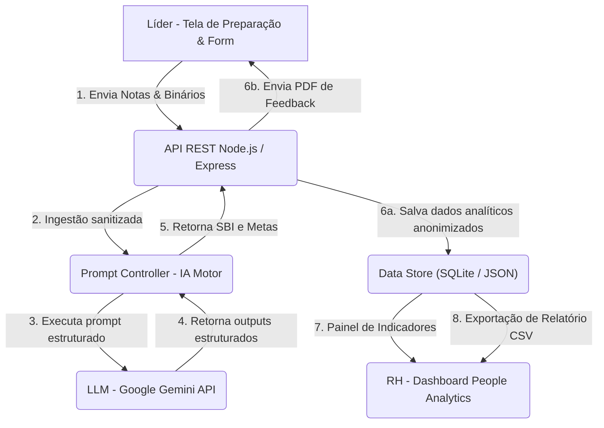

# Contexto Técnico (SSOT de Engenharia) — Pulse Mais & ClearIT

## 1. Stack Tecnológica
Para garantir leveza, facilidade de implantação e conformidade estrita no MVP, a arquitetura do **Pulse Mais** é baseada na seguinte stack:

*   **Frontend (Interface do Usuário):** HTML5, CSS3 Vanilla (sem Tailwind, seguindo os padrões do Onion Mini) e JavaScript (ES6+). Desenvolvido como uma Single Page App (SPA) responsiva rodando no browser (desktop e mobile).
*   **Backend / API Server:** Node.js com Express para orquestração de endpoints e integração com a LLM.
*   **Banco de Dados (Persistência):** SQLite local para ambiente de homologação (PoC) e PostgreSQL planejado para produção (armazenamento estrito de dados quantitativos e registros anonimizados).
*   **Serviço de Inteligência Artificial (LLM Engine):** Google Gemini API (modelo `gemini-2.5-flash` para triagem rápida e custo-eficiente; `gemini-2.5-pro` para calibrações de carreira mais complexas).
*   **Formatos de Saída (Exportação):** PDF gerado no client-side (via biblioteca `jspdf` para relatórios do líder) e CSV para exportação em lote de dados do RH.

---

## 2. Padrões de Código & Gotchas
*   **Gotchas conhecidos:**
    *   A API do Gemini exige higienização rigorosa antes do envio para evitar vazamento acidental de tokens com PII (Personally Identifiable Information).
    *   O processamento de texto corrido requer sanitização HTML no frontend para evitar falhas de XSS no momento de renderizar as respostas estruturadas da IA.
    *   Respostas nulas ou incompletas no formulário impedem a chamada do modelo para poupar chamadas de API desnecessárias.

---

## 3. Arquitetura & Fluxo de Componentes

O fluxo de circulação de dados na plataforma Pulse Mais está modelado abaixo:



---

## 4. Decisões Técnicas (ADR-lite)

### **`ADR01` — Pivot de Gravação de Áudio para Questionário Síncrono de Fechamento**
*   **Contexto:** O briefing do Desafio A propunha a gravação contínua do áudio das reuniões e a transcrição via IA.
*   **Trade-offs Avaliados:** 
    *   *Gravação de Áudio:* Alta fricção técnica, custo elevado de infraestrutura (storage de mídia), inibição de líderes/colaboradores (reduzindo a sinceridade do papo) e alto passivo de segurança jurídica pela LGPD (biometria de voz).
    *   *Questionário Síncrono:* Coleta ágil em 5 minutos das métricas de temperatura em formato Sim/Não e uma dissertação executiva resumindo a reunião.
*   **Decisão:** Pivotamos o escopo técnico para o modelo de Questionário Síncrono de Fechamento.
*   **Consequência:** Redução drástica de custos operacionais, facilidade no processamento da IA (apenas texto simples), garantia de segurança psicológica do time e conformidade instantânea com a LGPD.

### **`ADR02` — Padronização de Feedbacks via Modelo SBI (Situação, Comportamento, Impacto)**
*   **Contexto:** Líderes técnicos ou recém-promovidos têm dificuldades em redigir feedbacks estruturados, gerando anotações vagas, subjetivas e reativas.
*   **Decisão:** Centralizar a engenharia de prompt da IA para que reescreva as dissertações executivas inseridas obrigatoriamente no padrão SBI.
*   **Consequência:** Garante neutralidade, clareza no desenvolvimento do liderado, e padroniza os registros históricos permitindo uma comparação justa nos comitês de calibração.

### **`ADR03` — Guardrail Ativo de Ingestão e Higienização de Dados (Filtro Antifofoca)**
*   **Contexto:** Para gerar dados macros úteis ao RH, os dados das 1:1s precisam ser centralizados, mas o acesso livre a relatórios íntimos quebra a confiança do processo de mentoria.
*   **Decisão:** Implementar uma camada de processamento intermediária por IA que descarte nomes próprios, menções a terceiros não-envolvidos ("fofocas"), condições de saúde e queixas pessoais, extraindo e compilando apenas dados agregados e profissionais.
*   **Consequência:** O RH ganha métricas agregadas de maturidade, barreiras de infraestrutura e prontidão de promoção sem comprometer a confidencialidade individual ou expor dados privados.

---

## 5. Contrato da API REST

A comunicação entre a Interface do Usuário e o servidor backend é realizada de forma síncrona através do endpoint de fechamento de reuniões:

### Endpoint: `POST /api/meetings/close`

*   **Content-Type:** `application/json`

#### Payload de Envio (Request JSON):
```json
{
  "id_lider": "LID-8902",
  "id_liderado": "COL-1123",
  "data_reuniao": "2026-07-06T18:00:00Z",
  "respostas_fechadas": {
    "alinhamento_pdi": "SIM",
    "gargalo_infraestrutura": "NÃO",
    "dificuldade_tecnica": "SIM"
  },
  "dissertacao_argumentativa": "Discutimos o desempenho na sprint atual. O colaborador demonstrou excelente autonomia na última sprint, mas travou na configuração dos ambientes logo no início da semana devido à falta de documentação, porém buscou ajuda proativamente e resolveu o problema de forma rápida."
}
```

#### Resposta do Servidor (Response JSON):
```json
{
  "status": "success",
  "id_reuniao": "10293",
  "feedback_sbi_lider": {
    "situacao": "Configuração de ambientes de desenvolvimento na sprint atual.",
    "comportamento": "O colaborador travou por falta de documentação, mas buscou ajuda e resolveu proativamente.",
    "impacto": "Resolução rápida do problema e manutenção do ritmo de entregas do time.",
    "sugestao_pdi": "Documentar a resolução do ambiente de desenvolvimento na wiki da equipe."
  },
  "log_higienizado_rh": {
    "status_pdi": "ATIVO",
    "barreiras_comportamentais": false,
    "prontidao_carreira": "ELEGIVEL_PLENO"
  }
}
```

---

## 6. Modelo de Dados (Schemas)

A persistência do sistema estrutura-se em cinco entidades fundamentais:

```json
{
  "Lider": {
    "id": "String (PK)",
    "nome": "String",
    "cargo": "String",
    "area": "String",
    "nivel_madureza": "Enum (INICIANTE | EM_DESENVOLVIMENTO | CONSISTENTE | REFERENCIA)"
  },
  "Liderado": {
    "id": "String (PK)",
    "nome": "String",
    "cargo": "String",
    "nivel_levels": "String (L1 | L2 | L3 | L4)",
    "data_admissao": "Date"
  },
  "Reuniao": {
    "id": "String (PK)",
    "id_lider": "String (FK)",
    "id_liderado": "String (FK)",
    "data_reuniao": "DateTime",
    "alinhamento_pdi": "Boolean",
    "gargalo_infraestrutura": "Boolean",
    "dificuldade_tecnica": "Boolean",
    "duracao_minutos": "Integer"
  },
  "FeedbackSBI": {
    "id_reuniao": "String (PK, FK)",
    "situacao": "String",
    "comportamento": "String",
    "impacto": "String",
    "sugestao_pdi": "String",
    "revisado_lider": "Boolean"
  },
  "RHAuditLog": {
    "id_reuniao": "String (PK, FK)",
    "status_pdi": "Enum (ATIVO | INATIVO)",
    "barreiras_comportamentais": "Boolean",
    "prontidao_carreira": "Enum (INSUFICIENTE | ELEGIVEL_PLENO | ELEGIVEL_SENIOR)",
    "sinalizacao_risco_turnover": "Boolean",
    "data_higienizacao": "DateTime"
  }
}
```

---

## 7. Evidência de Teste da PoC
A validação das regras de negócios e prompts foi registrada com sucesso no arquivo local `src/mock_form_input.json` utilizando o prompt estruturado de classificação quanti-qualitativo. O motor de IA identificou corretamente as competências e gerou o output exato alinhado com o esperado pelas personas e pelo RH da ClearIT.

